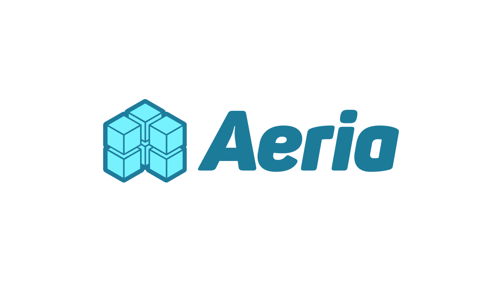

[](https://gitter.im/CaffeinaLab/aeria?utm_source=badge&utm_medium=badge&utm_campaign=pr-badge&utm_content=badge)

[](https://scrutinizer-ci.com/g/CaffeinaLab/aeria/?branch=master)

> Aeria is a modular, lightweight, fast WordPress Application development kit.


## Documentation

See the [wiki](https://github.com/CaffeinaLab/aeria/wiki).


## Contributing

How to get involved:

1. [Star](https://github.com/CaffeinaLab/aeria/stargazers) the project!
2. Answer questions that come through [GitHub issues](https://github.com/CaffeinaLab/aeria/issues?state=open)
3. [Report a bug](https://github.com/CaffeinaLab/aeria/issues/new) that you find


Aeria follows the [GitFlow branching model](http://nvie.com/posts/a-successful-git-branching-model). The ```master``` branch always reflects a production-ready state while the latest development is taking place in the ```develop``` branch.

Each time you want to work on a fix or a new feature, create a new branch based on the ```develop``` branch: ```git checkout -b BRANCH_NAME develop```. Only pull requests to the ```develop``` branch will be merged.

Pull requests are **highly appreciated**.

Solve a problem. Features are great, but even better is cleaning-up and fixing issues in the code that you discover.

## Versioning

Aeria is maintained by using the [Semantic Versioning Specification (SemVer)](http://semver.org).


## Copyright and license

Copyright 2015 [Caffeina](http://caffeina.it) srl under the [MIT license](LICENSE.md).

<p align="center"><a href="http://caffeina.co" target="_blank" title="Caffeina - Ideas Never Sleep"></a></p>
